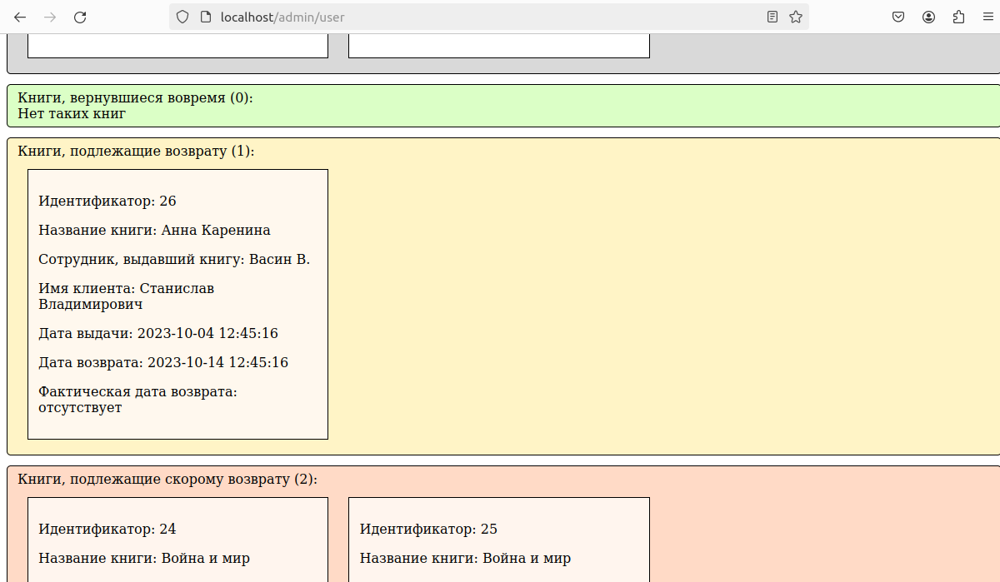

## Тестовый проект для демонстрации понимания работы Laravel framework ##

### Что используем: ###
- Docker
- Docker-compose
- Nginx
- MySQL
- Laravel 11
- Vite
- Vue 3

### Описание задачи: ###

Существует библиотека. В ней работают сотрудники... в частности, библиотекари,
которые обслуживают клиентов (выдают и получают обратно книги).  
Требуется: \
- Сделать авторизацию пользователей
- Сделать разделение по ролям (помимо разделения на работников и клиентов, могут быть сотрудники разных подразделений)
- Книги выдаются на определенный срок. Нужно выводить информацию о книгах, находящихся на руках и требующих возврата.

### Реализация: ###

Учитывая то, что клиенты и сотрудники - принципиально разные сущности, 
сервисы, которыми они будут пользоваться - тоже разные. \
*library-app-employees, nginx-library-employees, node-employees* - для сотрудников \
*library-app-clients, nginx-library-clients, node-clients* - для клиентов. \
А чтобы все это работало под одним доменом будем проксировать запросы. \
 
По поводу структуры БД:
1. Отсутствуют внешние ключи. Не потому что автор про них не знает, а просто время для них не пришло ッ
   (да - я собираюсь привести этот репозиторий к порядку.. со временем... а время - величина относительная 😊).
2. Есть книги. У них есть авторы (если понадобится сортировка или поиск по автору). Есть отдельная таблица учета экземпляров книг (т.к. есть вероятность, 
что книги будут заказывать, привозить, отдавать в архив и т.п.). 
3. Существует отдельная таблица с настройками, где выставляется количество дней на возврат книги (пока только это). 
В данный момент не задействована, т.к. задачи такой нет. \
 
Для авторизации пользователей используется JWT. \
 
На стороне Frontend работает Vue. У клиентов с router, у сотрудников без. \
Клиентские сервисы вообще существуют номинально ☺ \
 
У сотрудников на стороне Backend добавлен Middleware для проверки роли (а если быть точнее, 
то назначения, т.к. назначений у сотрудника может быть несколько). \
 
Все данные для демонстрации работы есть в migrations. Сначала их надо выполнить в приложении для клиентов, 
потом в приложении для сотрудников.\
После этого залогиниться под сотрудником (с ролью библиотекаря) и перейти на страницу http://yourdomain/admin/user.
Будут показаны книги, которые были выданы.

 
Спасибо за внимание! ッ